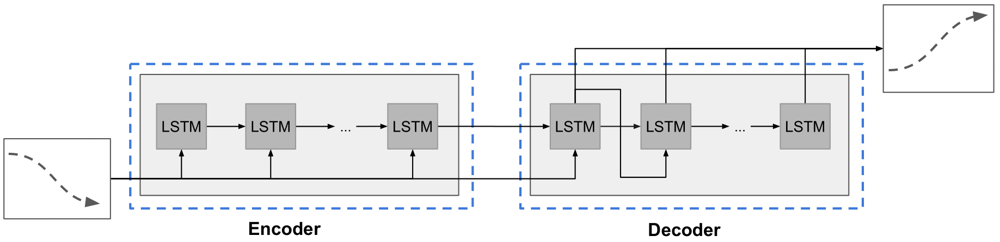
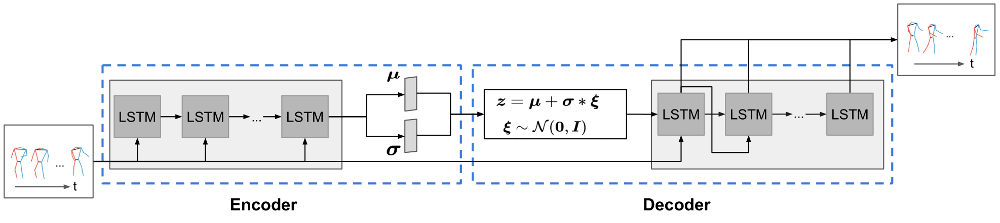
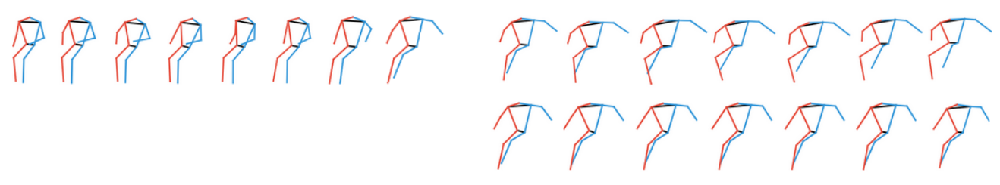

# Learning Decoupled Representations for Human Pose Forecasting

## _Absract_:

_Human pose forecasting_, *i.e.*, forecasting human body keypoints' locations given a sequence of observed ones, is a challenging task due to the uncertainty in human pose dynamics. 
Many approaches have been proposed to solve this problem, including Long Short-Term Memories (LSTMs) and Variational AutoEncoders (VAEs). Yet, they do not effectively predict human motions when both global trajectory and local pose movements exist.
We propose to learn a representation that decouples the global and local pose forecasting tasks. We also show that it is better to stop the prediction when the uncertainty in human motion increases. 
Our forecasting model outperforms all existing methods on the pose forecasting benchmark to date by over 20%. The code will be made available online.

## Introduction:
This is the official code for the paper ["Learning Decoupled Representation for Human Pose Forecasting"](https://openaccess.thecvf.com/content/ICCV2021W/SoMoF/html/Parsaeifard_Learning_Decoupled_Representations_for_Human_Pose_Forecasting_ICCVW_2021_paper.html), accepted and published in ["ICCVW 2021"](https://somof.stanford.edu/workshops/iccv21).

Here, you will find the [Poster](https://drive.google.com/file/d/1qcHiTlGGG8KNk6sUPMnTSvkjcq9oVT32/view?usp=sharing), the [Slides](https://drive.google.com/file/d/1k5S_yFnzcBea9g8ZlieCSq77vas-5VGu/view?usp=sharing) and the [Video](https://drive.google.com/file/d/1GE9xTHDEBrRZAlck7trpWaMorlX0_e3z/view?usp=sharing).

## Contents
------------
  * [Repository Structure](#repository-structure)
  * [Proposed Method](#proposed-method-DeRPoF)
  * [Results](#results)
  * [Installation](#installation)
  * [Dataset](#dataset)
  * [Training/Testing](#training-testing)
  * [Tested Environments](#tested-environments)
  
## Repository structure:
------------
    ├── pose-prediction                 : Project repository
        ├── 3dpw 
            ├── somof_data_3dpw         : Dataset for 3dpw.
            ├── train.py                : Script for training.  
            ├── valid.py                : Script for validating on validation set.
            ├── test.py                 : Script for testing on test set.  
            ├── DataLoader.py           : Script for data loader for train and validation datasets. 
            ├── DataLoader_test.py      : Script for data loader for test set.
            ├── model.py                : Script containing the implementation of the network.
            ├── utils.py                : Script containing necessary functions.
            ├── viz.py                  : Script for visualization.
        ├── posetrack
            ├── somof_data_posetrack    : Dataset for posetrack.
            ├── train.py                : Script for training.  
            ├── valid.py                : Script for validating on validation set.
            ├── test.py                 : Script for testing.  
            ├── DataLoader.py           : Script for data loader for train and validation datasets. 
            ├── DataLoader_test.py      : Script for data loader for test set.
            ├── model.py                : Script containing the implementation of the network.
            ├── utils.py                : Script containing necessary functions.
            
## Proposed method DeRPoF
-------------
We decouple the pose forecasting into a global trajectory forecasting and a local pose forecasting as shown below:


-------------

* Our LSTM-encoder-decoder network for the global trajectory forecasting:


-------------

* Our proposed VAE-encoder-decoder network for the local pose forecasting:


## Results

We show the observed (left) and the predicted (right) poses for two different scenarios. The rows correspond to DeRPoF w/o early stop and w/o Decoupling from top to bottom. Only the pose of every other frame is shown. 



## Installation:
------------
Start by cloning this repositiory:
```
git clone https://github.com/vita-epfl/decoupled-pose-prediction
cd decoupled-pose-prediction
```
Create a virtual environment:
```
virtualenv myenv
source myenv/bin/activate
```
And install the dependencies:
```
pip install -r requirements.txt
```

## Dataset:
  
  * We use the preprocessed dataset of the [SoMoF](https://somof.stanford.edu/dataset) challenge. For easy usage, these datasets for 3dpw and posetrack are available in directories 3dpw/ and posetrack/ respectively. 
  
## Training/Validating/Testing:
In order to train the model for 3dpw:
```
cd 3dpw/
python train.py  [--hidden_dim hidden_dim --latent_dim latent_dim --embedding_dim embedding_dim --dropout dropout --lr lr --n_epochs n_epochs --batch_size batch_size --loader_shuffle loader_shuffle  --load_checkpoint load_checkpoint --dev dev]
```
where the above options are:
* hidden_dim (int): hidden state dimension (default: 64)
* latent_dim (int): the dimension of the latent space (default: 32)
* embedding_dim (int): the embedding dimension (default: 8)
* dropout (float): dropout (default: 0.2)
* lr (float): initial learning rate (default: 0.001)
* n_epochs (int): the number of epochs (default: 100)
* batch_size (int): the size of the batch (default: 60)
* loader_shuffle (bool): if the data should be shuffled (default: True)
* load_checkpoint (bool): to start from previous saved parameters (default: False)
* dev: device either 'cpu' or 'cuda', default is 'cpu'

For validating the model run the command:
```
python val.py [--hidden_dim hidden_dim --latent_dim latent_dim --embedding_dim embedding_dim --dropout dropout --dev dev]
```
The output will be the vim and vam values as well as some visualizations in the visualization folder.


Test the trained network by running the command:
```
python test.py [--hidden_dim hidden_dim --latent_dim latent_dim --embedding_dim embedding_dim --dropout dropout --dev dev]
```
where the options are similar to the training. 

## Tested Environments:
------------
  * Ubuntu 18.04, CUDA 10.1
 
 
## Acknowledgments

The base of the code is borrowed from [bounding box predictin](https://github.com/vita-epfl/bounding-box-prediction).

### Citation

```
@InProceedings{parsaeifard2021decoupled,
    author    = {Parsaeifard, Behnam and Saadatnejad, Saeed and Liu, Yuejiang and Mordan, Taylor and Alahi, Alexandre},
    title     = {Learning Decoupled Representations for Human Pose Forecasting},
    booktitle = {Proceedings of the IEEE/CVF International Conference on Computer Vision (ICCV) Workshops},
    month     = {October},
    year      = {2021},
    pages     = {2294-2303}
}

```
