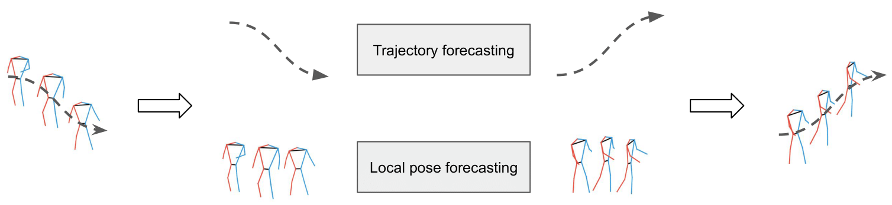
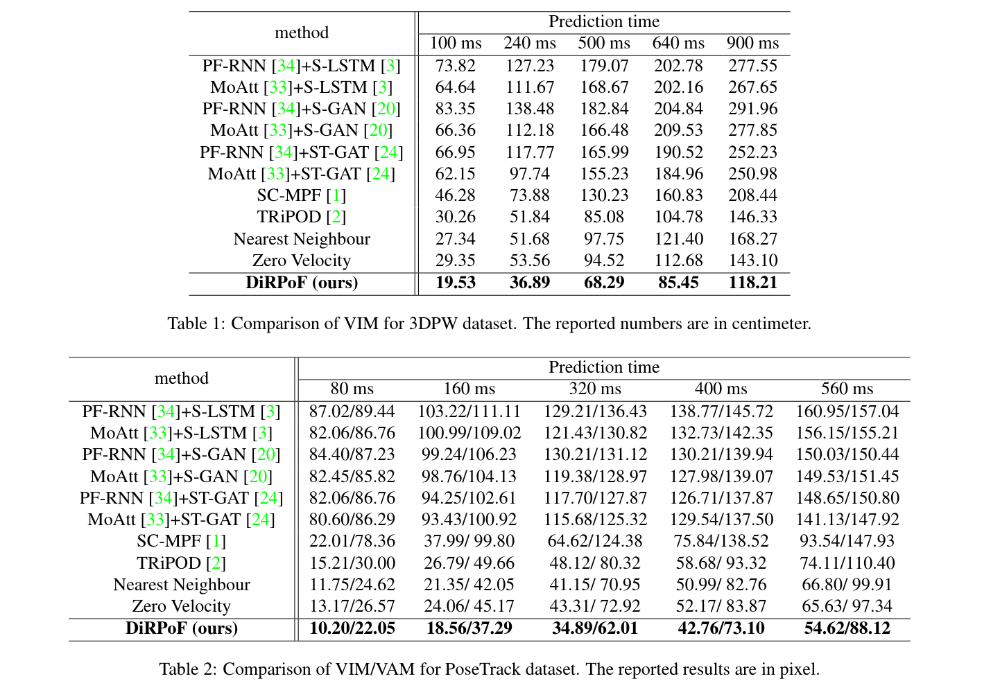

# Learning a Disentangled Representation for Human Pose Forecasting

## _Absract_:

Human pose forecasting, \em{i.e.}, forecasting human body keypoints' locations given a sequence of observed ones, is a challenging task due to the uncertainty in human pose dynamics. 
Many approaches have been proposed to solve this problem, including Long Short-Term Memories (LSTMs) and Variational AutoEncoders (VAEs). Yet, they do not effectively predict human motions when both global trajectory and local pose movements exist.
We propose to learn a representation that disentangles the global and local pose forecasting tasks. We also show that it is better to stop the prediction when the uncertainty in human motion increases. 
Our forecasting model outperforms all existing methods on the pose forecasting benchmark to date by over $20\%$. The code will be made available online.

## Introduction:
This is the official code for the paper ["Learning a Disentangled Representation for Human Pose Forecasting"](link), accepted and published in [ICCV 2021](http://iccv2021.thecvf.com/home)

## Contents
------------
  * [Repository Structure](#repository-structure)
  * [Proposed Method](#proposed-method)
  * [Results](#results)
  * [Installation](#installation)
  * [Dataset](#dataset)
  * [Training/Testing](#training-testing)
  * [Tested Environments](#tested-environments)
  
## Repository structure:
------------
    ├── pose-prediction                 : Project repository
          ├── 3dpw 
            ├── train.py                : Script for training.  
            ├── test.py                 : Script for testing.  
            ├── DataLoader.py           : Script for data loader. 
            ├── model.py                : Script containing the implementation of the network.
            ├── utils.py                : Script containing necessary functions.
          ├── posetrack
            ├── train.py                : Script for training.  
            ├── test.py                 : Script for testing.  
            ├── DataLoader.py           : Script for data loader. 
            ├── model.py                : Script containing the implementation of the network.
            ├── utils.py                : Script containing necessary functions.
            
## Proposed method
-------------
* Our proposed method:


-------------

* Our proposed network architecture for trajectory prediction:


-------------

* Our proposed network architecture for pose prediction:


## Results
--------------
* Comparision of our model with other methods

-------------
* Example of outputs


  
## Installation:
------------
Start by cloning this repositiory:
```
git clone https://github.com/vita-epfl/pose-prediction
cd pose-prediction
```
Create a new conda environment (Python 3.6):
```
conda create -n DirPoF python=3.6
conda activate DiRPoF
```
And install the dependencies:
```
pip3.6 install -r requirements.txt
```

## Dataset:
  
  * We use the preprocessed dataset of the [SoMoF](https://somof.stanford.edu/dataset) challenge. These datasets for 3dpw and posetrack are available in directories 3dpw/ and posetrack/ respectively. 
  
## Training/Testing:
In order to train the model for 3dpw:
```
cd 3dpw/
python3.6 train.py  [--hidden_dim --latent_dim --embedding_dim --dropout --lr --n_epochs --batch_size --loader_shuffle --load_checkpoint  ]
```
where the above options are:
* hidden_dim (int): hidden state dimension (default: 64)
* latent_dim (int): the dimension of the latent space (default: 32)
* embedding_dim (int): the embedding dimension (default: 8)
* dropout (float): dropout (default: 0.2)
* lr (float): initial learning rate (default: 0.001)
* n_epochs (int): the number of epochs (default: 100)
* batch_size (int): the size of the batch (default: 60)
* loader_shuffle (bool): if the data should be shuffled (default: True)
* load_checkpoint (bool): to start from previous saved parameters (default: False)
Test the trained network by running the command:
```
python3.6 test.py
```

## Tested Environments:
------------
  * Ubuntu 18.04, CUDA 10.1
 
